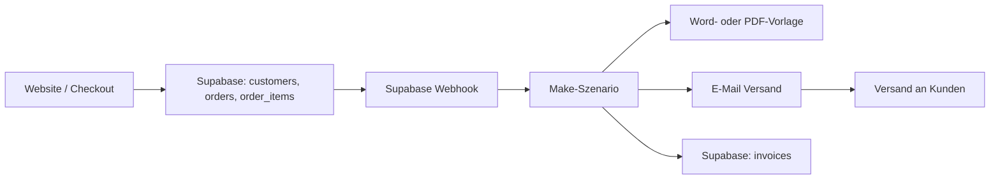

# Zielarchitektur und Prozessfluss

Die Website nimmt Bestellungen entgegen, Supabase speichert die operativen Daten, Make orchestriert den Folgeprozess, Word/PDF liefert die standardisierte Rechnung, danach wird die Bestell- und Rechnungs-E-Mail direkt versendet.

## Statuskette

### Bestellung

- `created`
- `paid`
- `invoice_pending`
- `invoice_draft_created`
- `completed`

### Rechnung

- `draft`
- `sent`
