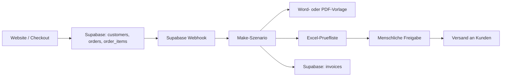

# Zielarchitektur und Prozessfluss

Die Website nimmt Bestellungen entgegen, Supabase speichert die operativen Daten, Make orchestriert den Folgeprozess, Word/PDF liefert die standardisierte Rechnung, Excel dient der menschlichen Kontrolle.

## Statuskette

### Bestellung

- `created`
- `paid`
- `invoice_pending`
- `invoice_draft_created`
- `completed`

### Rechnung

- `draft`
- `needs_review`
- `approved`
- `sent`
- `rejected`
