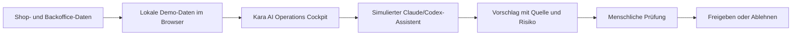
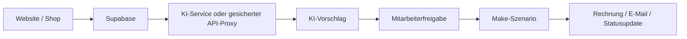

# Zielarchitektur und Prozessfluss

Die aktuelle MVP-Architektur ist bewusst lokal und präsentationssicher. Die
Website zeigt ein KI-Operations-Cockpit, lokale Demo-Daten und den bestehenden
Shop als Datenquelle. Externe KI-, Supabase- und Make-Anbindungen sind für
spätere Ausbaustufen vorgesehen.

```mermaid
flowchart LR
    A["Shop- und Backoffice-Daten"] --> B["Lokale Demo-Daten im Browser"]
    B --> C["Kara AI Operations Cockpit"]
    C --> D["Simulierter Claude/Codex-Assistent"]
    D --> E["Vorschlag mit Quelle und Risiko"]
    E --> F["Menschliche Prüfung"]
    F --> G["Freigeben oder Ablehnen"]
```

## Aktueller MVP

- statische Website in `website/`
- lokale Speicherung im Browser mit `localStorage`
- simulierte KI-Vorschläge ohne API-Key
- Shop bleibt als operative Datenquelle sichtbar
- Freigabeprinzip: KI erstellt Vorschlag, Mensch entscheidet

## Lokale Demo-Collections

- `kara_ai_tasks`
- `kara_support_cases`
- `kara_ai_runs`
- `kara_knowledge_base`
- bestehend: `kara_cart`, `kara_customers`, `kara_orders`, `kara_invoices`,
  `kara_emails`

## Statuskette für KI-Vorschläge

- `draft`
- `reviewed`
- `approved`
- `rejected`

## Spätere Zielarchitektur

```mermaid
flowchart LR
    A["Website / Shop"] --> B["Supabase"]
    B --> C["KI-Service oder gesicherter API-Proxy"]
    C --> D["KI-Vorschlag"]
    D --> E["Mitarbeiterfreigabe"]
    E --> F["Make-Szenario"]
    F --> G["Rechnung / E-Mail / Statusupdate"]
```

Für eine produktive Version müssten Datenschutz, Rollenrechte, API-Key-Schutz,
Logging und menschliche Freigabe konkret umgesetzt werden.
