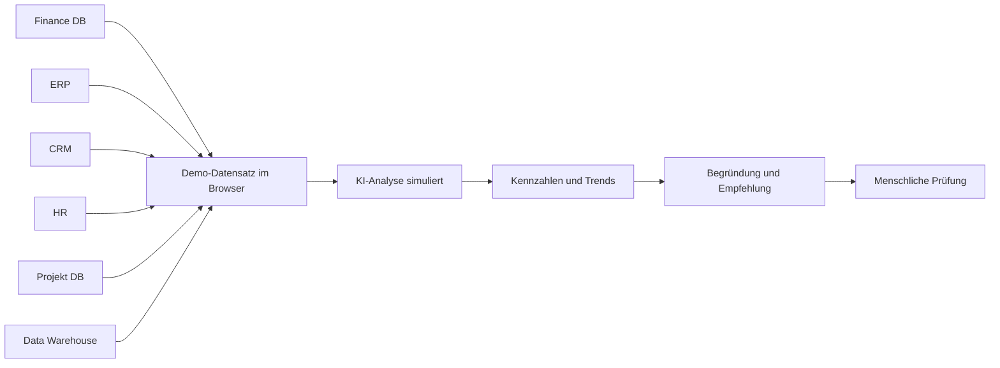
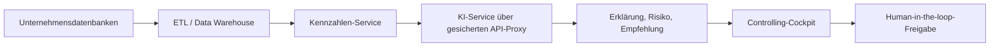

# Zielarchitektur und Prozessfluss

Die aktuelle MVP-Architektur ist bewusst statisch und präsentationssicher. Die
Website zeigt eine interaktive Demo für KI-gestütztes Controlling, ohne echte
Datenbanken oder externe KI-Dienste anzubinden.

## Aktueller MVP

- statische Website in `website/`
- Demo-Daten direkt in `website/script.js`
- interaktive Fallbeispiel-Auswahl
- Szenario-Umschaltung für das Controlling-Cockpit
- SVG-Trenddiagramm ohne externe Chart-Bibliothek
- simulierte KI-Analyse mit Empfehlung, Risiko und Datenqualität

```mermaid
flowchart LR
    A["Finance DB"] --> G["Demo-Datensatz im Browser"]
    B["ERP"] --> G
    C["CRM"] --> G
    D["HR"] --> G
    E["Projekt DB"] --> G
    F["Data Warehouse"] --> G
    G --> H["KI-Analyse simuliert"]
    H --> I["Kennzahlen und Trends"]
    I --> J["Begründung und Empfehlung"]
    J --> K["Menschliche Prüfung"]
```

## Fachlicher Datenfluss

1. Alle relevanten Unternehmensdatenbanken werden als Quellen gedacht.
2. Die KI aggregiert Daten und berechnet Kennzahlen.
3. Trends, Abweichungen und Auffälligkeiten werden erkannt.
4. Die KI formuliert Ursachenhypothesen und Handlungsempfehlungen.
5. Datenqualität und Risiko werden sichtbar gemacht.
6. Ein Mensch prüft die Empfehlung vor Umsetzung.

## Spätere Zielarchitektur

```mermaid
flowchart LR
    A["Unternehmensdatenbanken"] --> B["ETL / Data Warehouse"]
    B --> C["Kennzahlen-Service"]
    C --> D["KI-Service über gesicherten API-Proxy"]
    D --> E["Erklärung, Risiko, Empfehlung"]
    E --> F["Controlling-Cockpit"]
    F --> G["Human-in-the-loop-Freigabe"]
```

## Produktive Anforderungen

- Rollen- und Rechtekonzept
- Datenschutzprüfung
- gesicherter API-Key-Schutz
- Logging und Audit Trail
- Datenqualitätsprüfungen
- klare Verantwortlichkeiten für Empfehlungen
- keine automatischen Managemententscheidungen
